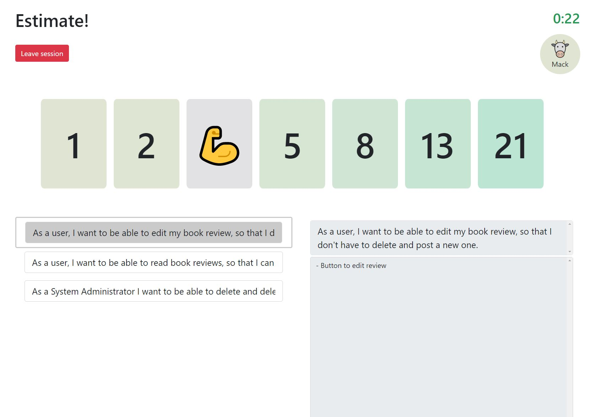

# Diveni - The Planning-Poker App


[](LICENSE)
[](https://crowdin.com/project/diveni)
[](https://discord.com/channels/935641426216222730/)


WebApp to do Planning Poker with remote teams using external issue tracker as source of stories.

Supported issue trackers:

- Atlassian JIRA on premise
- Atlassian JIRA Cloud
- More connectors are planned

## Read more

see: [Diveni Website](https://sybit-education.github.io/Diveni/)

---

## Some Screenshots




## Application Instructions and Requirements

### Technologies

Frontend communicates via REST and WebSockets with the backend.
It uses Spring boot and communicates directly with the mongoDb in a docker container.
Run the docker container first, then the backend.

### Run Diveni with Docker and Docker Compose
#### Run with pre-built docker images using [docker-compose](https://github.com/Sybit-Education/Diveni/blob/main/docker-compose.yml)
```shell
docker-compose up -d
```
#### Run with self-build docker images using [docker-compose.dev](https://github.com/Sybit-Education/Diveni/blob/main/docker-compose.dev.yml)
```shell
docker-compose -f docker-compose.dev.yml up --build -d
```

### Run Diveni locally

#### Frontend
- npm, vue2

```shell
npm install
npm run serve
```
 
#### Backend

- maven, springboot, java11

```shell
mvn spring-boot:run
```

#### Database

- Mongodb in docker on port 27017, no credentials (Run via docker desktop)


---

## Contributors


[](https://github.com/Sybit-Education/Diveni/graphs/contributors)


Made with [contrib.rocks](https://contrib.rocks).

## Credits

- Icons: [Animal by Thiago Silva](https://www.iconfinder.com/iconsets/animals-105), License: [CC0 1.0 Universal](https://creativecommons.org/publicdomain/zero/1.0/)

### HTWG Konstanz

TBD

### Sybit GmbH

Sybit supports teaching at the university at HTWG Konstanz and acted as an industry 
partner in this project. A product owner represented Sybit's requirements to the 
students and released the sprints in the agile project development.

[Sybit GmbH](https://www.sybit.de) will continue to support and maintain the project as an open source project.

---

## License

[LICENSE](LICENSE)
