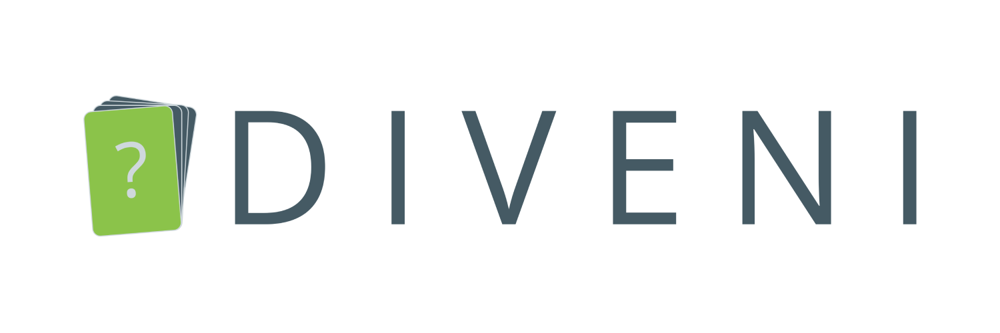
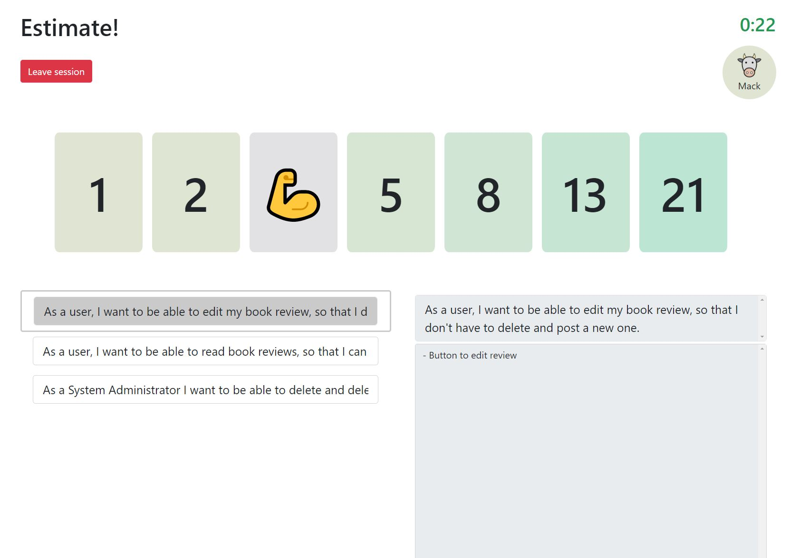
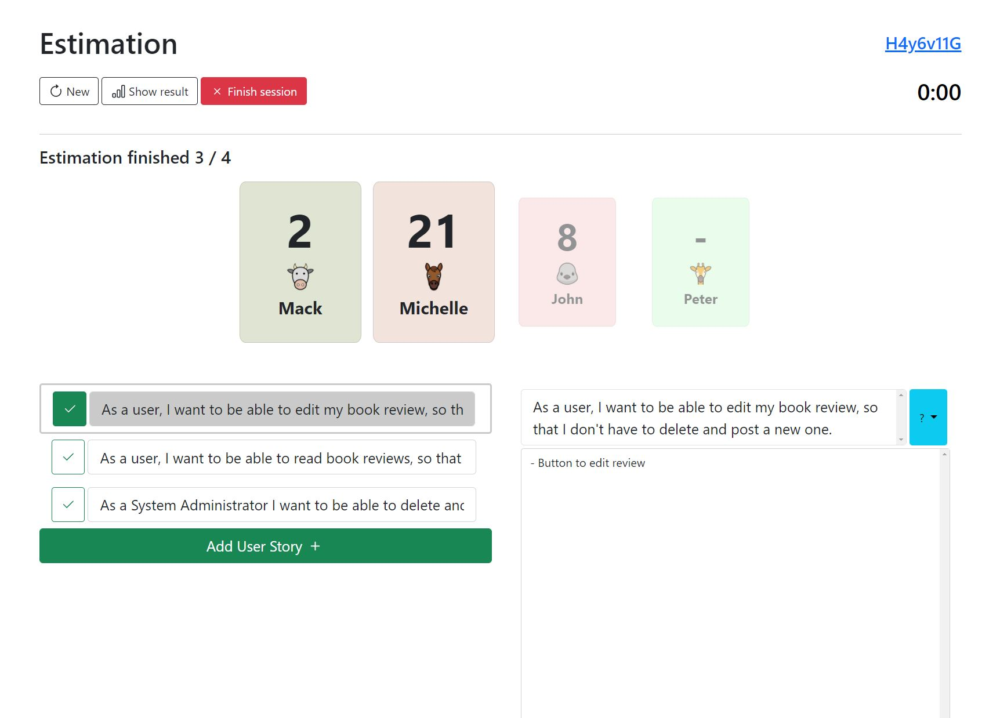

# Diveni - The Planning-Poker App


[](LICENSE)
[](https://discord.com/channels/935641426216222730/)




WebApp to do Planning Poker with remote teams using external issue tracker as source of stories.

Supported issue trackers:

- Atlassian JIRA onPremise
- Atlassian JIRA Cloud

More connectors are planned.

---

## Usage

Prepare a new session:

1.	Click on the left "GO" button to create a new session.
2.	You will be sent to the Prepare session page where you can customize the upcoming voting session for your team.
    - a.	As first step you choose the mode for your User Stories. You can choose to estimate
        - 1.	Without User Stories
        - 2.	With User Stories created in Diveni. You are then able to create User Stories on the right side.
        - 3.	With User Stories imported from Jira. Choosing the last option you’ll have to connect to your Jira account. It will be explained           how to connect and how to choose the correct project.
    Any mode specific information is given below the chosen mode.
    - b.	Second, you can decide which poker card set will be used for the upcoming voting session. You can choose between different sets: Fibonacci, T-shirt sizes (not for Jira US), hours or integer values. You can also select individually the range of each card set, including an additional „?“.
    - c.	In the third row, you can specify a timer for the voting session. The timer will automatically be initialized when starting the voting session. The value of the timer can be changed by clicking on the buttons on the left and right. The voting will automatically be stoped and the results will be shown when the timer hits zero.
    - d.	To finish the setting, you can secure your session by an optional password.
Finalize by clicking „Start Session“ on the bottom of the page.
3.	You will be sent to a waiting room where you can see which members already joined the meeting. Invite members by hovering over the blue code and copy the Session-ID or a direct link which you can send to your team members. 	After your members have joined, start the planning.
4.	After the voting has started, you can see at "Waiting for x/y" which members have already voted. You can restart the voting at any given time, by clicking on the "New" button. Don't forget to mark a story (flag it with the button on the left side), so the members know which story they are estimating. Click on the "Show result" button or wait for the timer to see which values your members have voted for. You are always able to edit, delete or add User Stories, including setting the vote the members have agreed on.
5.	If you have estimated all your stories, click on the red button to end the meeting and get an overview of your final results for your stories.
6.	Download your results as a CSV file by clicking on the green button after ending the meeting or click on "Go to Home" to go to the landing page.

Join a meeting:
1.	Click on the right "GO" button to join an existing session.
2.	Enter your Name and the meeting-ID, or join via session-link and enter your name and the optional password. Click "GO" to join the session.
3.	After joining the session you have to wait until the host starts the planning.
4.	When the planning has been started you can swipe or click depending on your device, to select your estimated value. You can open the story description below the voting cards and check which story you are estimating. The highlighted one ist he story your host has selected. If you wish to read another description just click on one of the other stories.
5.	The planning will be stopped by the host or as soon the timer hits zero.
Depending on your device, you can see the results of the other members.
6.	The planning can be restarted at any given time by the host.

## Screenshots

<div align="center">
  
  
</div>

## Application Instructions and Requirements:

### Technologies:
Frontend communicates via REST and WebSockets with the backend.
It uses Spring boot and communicates directly with the mongoDb in a docker container.
Run the docker container first, then the backend.
#### Frontend
- npm, vue2
```shell
npm install
npm run serve
```
 
#### Backend
- maven, springboot, java11
```shell
mvn spring-boot:run
```

#### Database
- Mongodb in docker on port 27017, no credentials (Run via docker desktop)

Icons from https://www.iconfinder.com/iconsets/animals-105

---

## Credits

### HTWG Konstanz

TBD

### Sybit GmbH

Sybit supports teaching at the university in Constance and has appeared as an industry partner 
in this project. partner in this project. A product owner represented Sybit's requirements to the 
students and approved the releases in the agile project development.

Sybit will continue to support and maintain the project.

---

## License

[LICENSE](LICENSE)
