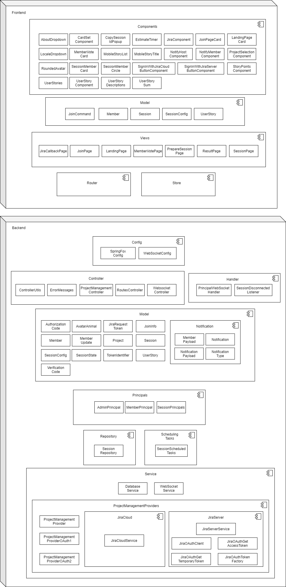
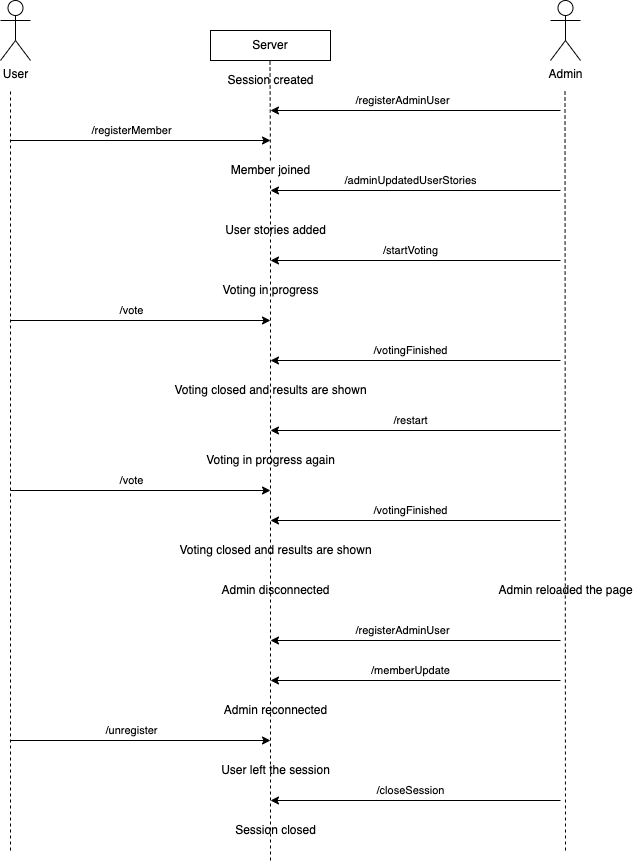

Software architecture
---------------------

##Content Overview

    1 Context diagram
    2 Component diagram
    3 Database
    4 Distribution diagram
    5 Testing
    6 Deployment

1 Context diagram
----------------------

The diagram below is a context diagram. It serves to illustrate the system from a black box perspective. Furthermore, interfaces to other systems are also depicted here. 
A connection to a Jira instance is required.

2 Component diagram
--------------------------------------

Context delineation provided insight of the system from a black box perspective. In the building block view
the internal structure and the components to be developed are now considered.

## Component Overview

### Frontend

| Component | Description   |
| --------- | -----------   |
| AboutDropdown |  |
| CardSetComponent |  |
| CopySessionIdPopup |  |
| EstimateTimer |  |
| JiraComponent |  |
| JoinPageCard |  |
| LandingPageCard |  |
| LocaleDropdown |  |
| MemberVoteCard |  |
| MobileStoryList |  |
| MobileStoryTitle |  |
| NotifyHostComponent |  |
| NotifyMemberComponent |  |
| ProjectSelectionComponent |  |
| RoundedAvatar |  |
| SessionMemberCard |  |
| SessionMemberCircle |  |
| SignInWithJiraCloudButtonComponent |  |
| SignInWithJiraServerButtonComponent |  |
| StoryPointsComponent |  |
| UserStories |  |
| UserStoryComponent |  |
| UserStoryDescriptions |  |
| UserStorySum |  |
| ----------- | |
| JoinCommand |  |
| Member |  |
| Session |  |
| SessionConfig |  |
| UserStory |  |
| ----------- | |
| JiraCallbackPage |  |
| JoinPage |  |
| LandingPage |  |
| MemberVotePage |  |
| PrepareSessionPage |  |
| ResultPage |  |
| SessionPage |  |
| ----------- | |
| Router |  |
| ----------- | |
| Store |  |

### Backend

| Component | Description   |
| --------- | -----------   |
| SpringFoxConfig | Configuration for automatic Swagger API generation |
| WebSocketConfig | Configurations (e.g. prefixes, CORS) for Websockets |
| ----------- | |
| ControllerUtils | Helper functions for all controllers |
| ErrrorMessages | All error messages which can be thrown in exceptions |
| ProjectManagementController | REST Controller for project management software (e.g. Jira) |
| RoutesController | REST Controller |
| WebsocketController | WebSocket Controller |
| ----------- | |
| PrincipalWebSocketHandler | Set anonymous user (Principal) in WebSocket messages by using uri query UUIDs. This is necessary to avoid broadcasting messages but sending them to specific user sessions |
| SessionDisconnectedListener | Listener when a user disconnects from a session |
| ----------- | |
| AuthorizationCode | Authorization code for OAuth1 |
| AvatarAnimal | Enum for the avatar animals |
| JiraRequestToken | Request token for Jira Server |
| JoinInfo | DTO to join a session |
| Member | Member model |
| MemberUpdate | Model for the current members and highlighted members |
| Project | Project for project management providers |
| Session | Session model |
| SessionConfig | Configuration for session (e.g. set, timer) |
| SessionState | Enum for the current state of the session |
| TokenIdentifier | Identifier for project management providers access token before a session was created |
| UserStory | User Story model |
| VerificationCode | Verification code for OAuth |
| ------ | |
| MemberPayload | Notification about a member |
| Notification | Generic notification |
| NotificationPayload | Abstract class for notification payloads |
| NotificationType | Notification types (e.g. Admin left, member left, member joined) |
| ----------- | |
| AdminPrincipal | Principal for admin |
| MemberPrincipal | Principal for member |
| SessionPrincipals | Principal for session |
| ----------- | |
| SessionRepository | Repository to save session data in the database |
| ----------- | |
| SessionScheduledTasks | Scheduled tasks which will be called in regular intervals (e.g. delete old sessions) |
| ----------- | |
| DatabaseService | Service to call the session repository |
| WebSockerService | Business logic for the WebSocket controller |
| ------ | |
| ProjectManagementProvider | Interface for all project management providers with functions which are necessary (e.g. getIssues) |
| ProjectManagementProviderOAuth1 | Interface for all project management providers with OAuth1 |
| ProjectManagementProviderOAuth2 | Interface for all project management providers with OAuth2 |
| ------ | |
| JiraCloudService | Implementation for Jira Cloud |
| ------ | |
| JiraServerService | Implementation for Jira Server |
| JiraOAuthClient | Helper class for Jira Server OAuth1 |
| JiraOAuthGetAccessToken | Helper class for Jira Server OAuth1 |
| JiraOAuthGetTemporaryToken | Helper class for Jira Server OAuth1 |
| JiraOAuthTokenFactory | Helper class for Jira Server OAuth1 |
| ----------- | |

3 API
-------------------

The current documentation for the REST API can be seen on https://pp.vnmz.de/api/swagger-ui.html.

This sequence diagram shows all Websocket commands and when they are used. 

4 Testing
---------

Functionalities of the application must be tested sufficiently to ensure quality. 
Backend methods are tested by Java unit tests. The test coverage is at least 75%.
Front-end components are tested using smoke tests on a test server.
Github runners are also used to automatically trigger and verify the tests.

