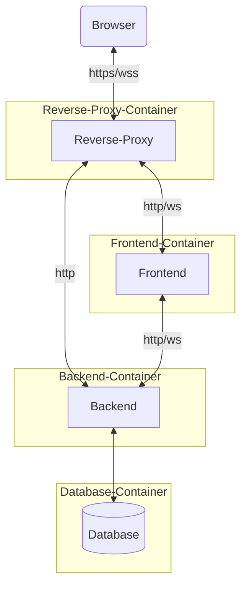
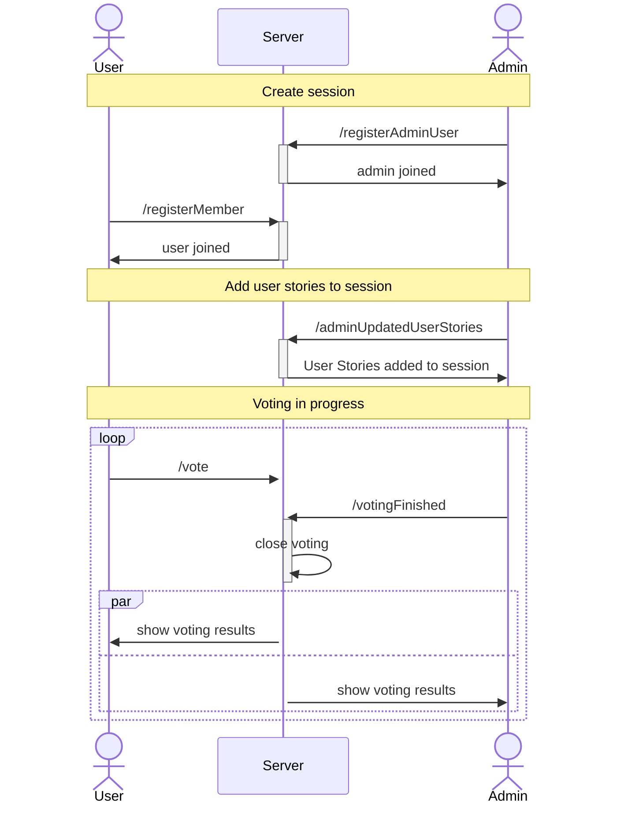
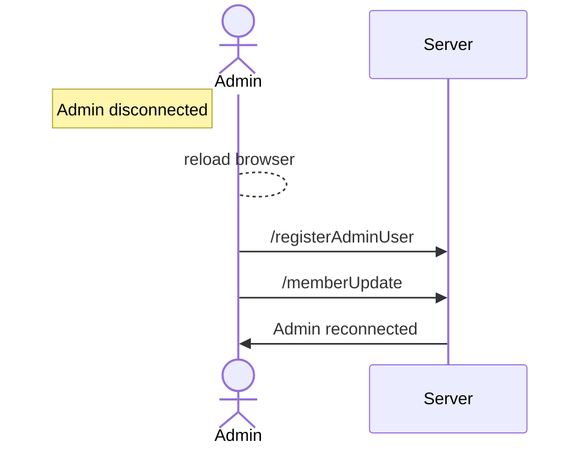
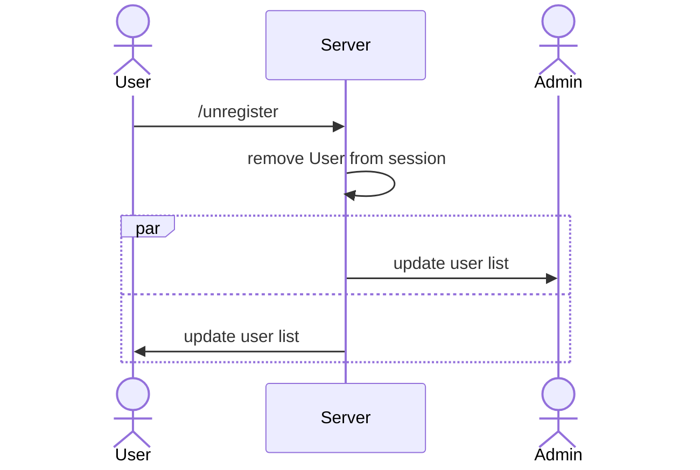
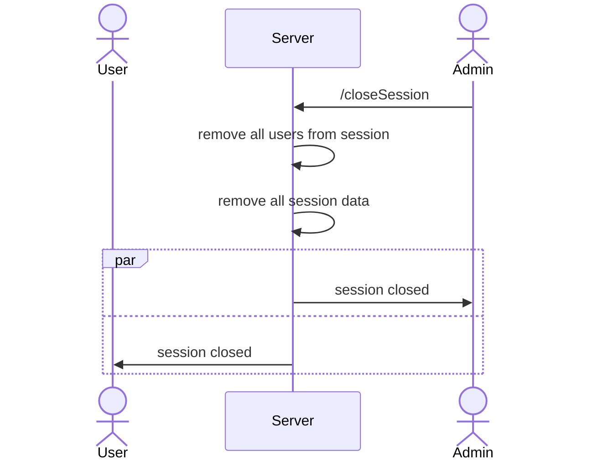

# Software Architecture

## Component Diagram

Context delineation provided insight of the system from a black box perspective. In the building block view
the internal structure and the components to be developed are now considered.

Diveni is separated in four Docker containers:

## Component Description

### Frontend

| Component | Description   |
| --------- | -----------   |
| AboutDropdown | Dropdown with links to front-/backend licenses |
| CardSetComponent | Card set selection in page "PrepareSession" |
| CopySessionIdPopup | Link including a popup with the functionalities: copy code or link to clipboard |
| EstimateTimer | Displays the timer and has the logic for the countdown |
| JiraComponent | Component for the "Planning with Jira" tab. |
| JoinPageCard | Card for joining a Session in page "JoinPage" |
| LandingPageCard | Cards for "New Session"/"Join Session"/"Reconnect to Session" in page "LandingPage" |
| LocaleDropdown | Dropdown for language selection |
| MemberVoteCard | The cards which the member can choose from. Used in page "MemberVotePage" |
| MobileStoryList | List of all user stories before and during the plannings. Especially for mobile devices. Used in page "MemberVotePage" |
| MobileStoryTitle | Title with optional collapsable description for the user stories. Especially for mobile devices. Used in page "MemberVotePage" |
| NotifyHostComponent | Triggers toast notifications for host. Does not have ui |
| NotifyMemberComponent | Triggers toast notifications for members. Does not have ui |
| ProjectSelectionComponent | Dropdown to select project after jira authentication in page "PrepareSession" |
| RoundedAvatar | Circle with animal emoji and name. Used in pages: "JoinPage"/"MemberVotePage"/"SessionPage" |
| SessionMemberCard | The cards representing the members with name, emoji and current estimation. Used in page "SessionPage" |
| SessionMemberCircle | The circle representing the members with name and emoji. Used in pages: "SessionPage"/"MemberVotePage" |
| SignInWithJiraCloudButtonComponent | Button which redirects to jira (cloud) authentication |
| SignInWithJiraServerButtonComponent | Button including the login logic for jira server |
| StoryPointsComponent | Includes text for "Planning without user stories"-Tab in page "PrepareSession" |
| UserStories | List of all user stories including the logic to select the current user story and the logic for submitting a value |
| UserStoryComponent | Includes text for "Planning with user stories"-Tab in page "PrepareSession" |
| UserStoryDescriptions | Displays the description for the selected user story |
| UserStorySum | Calculates and displays dynamically the sum of all estimated user stories |
| ----------- | |
| JoinCommand | Model for the command to join a session |
| Member | Model representing a member |
| Session | Model for a session including all relevant information |
| SessionConfig | Model which is used in the session model. Clusters all important information about the configs of the session|
| UserStory | Model representing a user story |
| ----------- | |
| JiraCallbackPage | Page for he jira callback when authenticating. Redirects immediately to the "PrepareSession" Page |
| JoinPage | Page for members to join a session |
| LandingPage | First page where a first time user normally lands. Includes the option a user has and redirects either to page "PrepareSession"/"JoinPage" or directly to "SessionPage" |
| MemberVotePage | The page for members when they join a session. It also includes the voting and selection which the Cards |
| PrepareSessionPage | The prepare Session Page displays a site where a admin can choose all important configs for the new session: user story mode, card set, timer or password |
| ResultPage | The ResultPage is displayed after a planning session is finished. It shows the results and the estimation overview over all user stories. Also includes a CSV-Export and a Link back to "LandingPage" |
| SessionPage | The SessionPage is displayed the admin before and during the planning sessions. It provides some functionality to control the planning like restart session, show estimations or end sessions. Also includes the possibility to add or change the user stories |
| ----------- | |
| Router | The Router includes all routes to the Pages with their specific links |
| ----------- | |
| Store | The store includes data which can be accessed from all views and components |

### Backend

| Component | Description   |
| --------- | -----------   |
| SpringFoxConfig | Configuration for automatic Swagger API generation |
| WebSocketConfig | Configurations (e.g. prefixes, CORS) for Websockets |
| ----------- | |
| ControllerUtils | Helper functions for all controllers |
| ErrrorMessages | All error messages which can be thrown in exceptions |
| ProjectManagementController | REST Controller for project management software (e.g. Jira) |
| RoutesController | REST Controller |
| WebsocketController | WebSocket Controller |
| ----------- | |
| PrincipalWebSocketHandler | Set anonymous user (Principal) in WebSocket messages by using uri query UUIDs. This is necessary to avoid broadcasting messages but sending them to specific user sessions |
| SessionDisconnectedListener | Listener when a user disconnects from a session |
| ----------- | |
| AuthorizationCode | Authorization code for OAuth1 |
| AvatarAnimal | Enum for the avatar animals |
| JiraRequestToken | Request token for Jira Server |
| JoinInfo | DTO to join a session |
| Member | Member model |
| MemberUpdate | Model for the current members and highlighted members |
| Project | Project for project management providers |
| Session | Session model |
| SessionConfig | Configuration for session (e.g. set, timer) |
| SessionState | Enum for the current state of the session |
| TokenIdentifier | Identifier for project management providers access token before a session was created |
| UserStory | User Story model |
| VerificationCode | Verification code for OAuth |
| ------ | |
| MemberPayload | Notification about a member |
| Notification | Generic notification |
| NotificationPayload | Abstract class for notification payloads |
| NotificationType | Notification types (e.g. Admin left, member left, member joined) |
| ----------- | |
| AdminPrincipal | Principal for admin |
| MemberPrincipal | Principal for member |
| SessionPrincipals | Principal for session |
| ----------- | |
| SessionRepository | Repository to save session data in the database |
| ----------- | |
| SessionScheduledTasks | Scheduled tasks which will be called in regular intervals (e.g. delete old sessions) |
| ----------- | |
| DatabaseService | Service to call the session repository |
| WebSockerService | Business logic for the WebSocket controller |
| ------ | |
| ProjectManagementProvider | Interface for all project management providers with functions which are necessary (e.g. getIssues) |
| ProjectManagementProviderOAuth1 | Interface for all project management providers with OAuth1 |
| ProjectManagementProviderOAuth2 | Interface for all project management providers with OAuth2 |
| ------ | |
| JiraCloudService | Implementation for Jira Cloud |
| ------ | |
| JiraServerService | Implementation for Jira Server |
| JiraOAuthClient | Helper class for Jira Server OAuth1 |
| JiraOAuthGetAccessToken | Helper class for Jira Server OAuth1 |
| JiraOAuthGetTemporaryToken | Helper class for Jira Server OAuth1 |
| JiraOAuthTokenFactory | Helper class for Jira Server OAuth1 |
| ----------- | |

## API

### REST API

The current documentation for the REST API can be seen on https://pp.vnmz.de/api/swagger-ui.html.

### Websocket

This sequence diagram shows all Websocket commands and when they are used. 

#### Websocket Sequence Diagrams

Diagrams created using [Mermaid](https://mermaid-js.github.io/mermaid/#/).

##### Create Session and Vote

###### Admin disconnected

##### Unregister User from Session

##### Close Session

