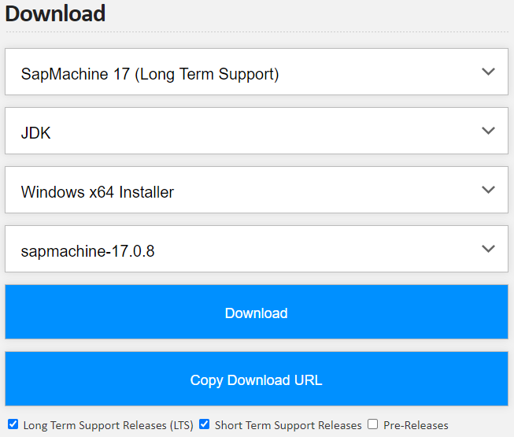
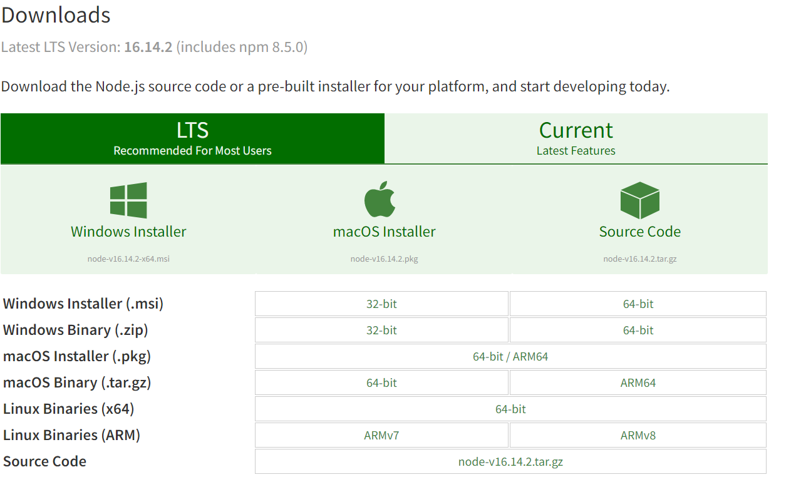
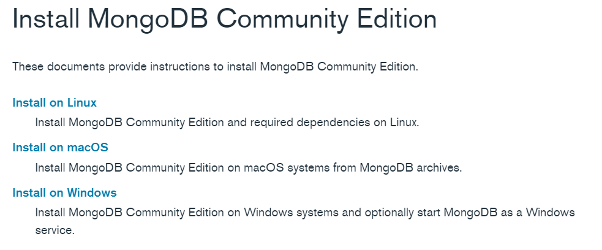

# Developers Guide


See also: 

* [Code of Conduct](../code_of_conduct)
* [Contribution](./contribution)

## Installation

### Software Requirements

- Java 17+
  - We prefer SapMachine but any other Java JDK 17+ is fine.
  - Download from SapMachine <https://sap.github.io/SapMachine/>

    
  - Select the appropriate installer for your OS
- Gradle
  - Download from Gradle official site <https://gradle.org/install/>
- Node.js 14+
  - Download from nodejs <https://nodejs.org/en/download/>

    
  - Select the appropriate installer for your OS
- MongoDB 4+
  - MongoDB is running in the background at port 27017
  - Select the appropriate installer for your OS and follow the instructions
    <https://www.mongodb.com/docs/manual/administration/install-community/>

    

### Setup Project

1. Clone repository with Git from GitHub:
    ```shell
    git clone https://github.com/Sybit-Education/Diveni.git
    ```
2. Start backend
* Open  first terminal and enter these commands:
  ```shell
  cd /backend
  gradle bootRun
  ```
* The backend should now be running and accessible at <http://localhost:8081>
3. Start frontend
* Open the second terminal and enter these commands:
  ```shell
  cd /frontend
  npm install
  npm run serve
  ```
* The frontend should now be running and accessible at <http://localhost:8080>
4. To use Diveni simply enter the following url in your standard browser: <http://localhost:8080>


## Issue-Tracker
- To set up Issue Tracker, see our [Installation Guide](install#issue-tracker).

## Troubleshooting

- When working with IntelliJ and starting Diveni's backend with IntelliJ's editor, it may throw an
  exception when trying to connect to an issue tracker.\
  This is because it cannot find the desired .env file in your working directory (/backend).
  If this happens, make sure to add ```/backend``` to your run working directory in the run
  configuration settings.
