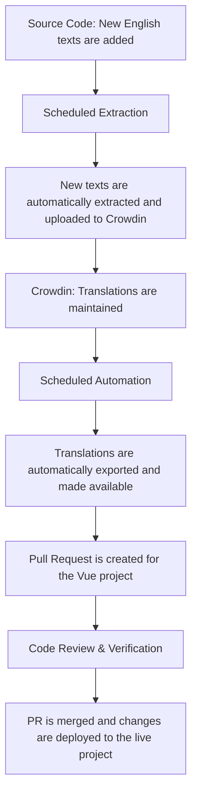

# Translations Guide

Translations for Diveni are maintained on [Crowdin](https://crowdin.com/project/diveni).

Crowdin is a web-based translation tool that can be used without knowledge of programming.

You can help by contributing to the improvement and expansion of our translations for Diveni. 
If you find a mistake or if your preferred language is not yet available, you can report and 
update it on Crowdin: [https://crowdin.com/project/diveni](https://crowdin.com/project/diveni).

::: warning Important:
Do not update translations directly in the source files on GitHub. Crowdin will overwrite them!
Only English labels are maintained in the project.
:::

## Translation Process

