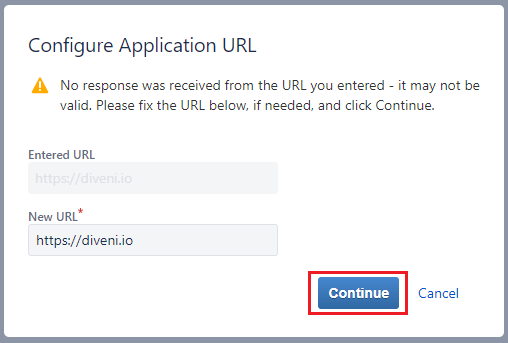

# Users Guide

*Guide for all users of Diveni.*

Diveni is a web application for Planning-Poker sessions. Sprint Planning often requires teams to
meet to estimate and plan user stories. With Diveni more flexibility is provided, team members can
do interactive planning from different locations. In addition, the mobile application offers JIRA
and Azure Devops integration.

By the way: "diveni" is Esperanto for "guess": <https://en.wiktionary.org/wiki/diveni>

## Roles

There are two roles of users:

* **Host**: Person which starts, configures and hosts planning session.
* **Team**: Persons voting User Stories.

---

## 1. Create new Session

To create a new session click on the "GO" button of the left window "New session".

 


After this you will be sent to *Prepare Session* page where you can customize the upcoming voting 
session for your team.

As first step you choose the mode for your User Stories. You can choose to estimate 

* Without User Stories 
* With User Stories created within Diveni. You are then able to create User Stories on the right side.
* With User Stories imported from an issue tracker. Choosing the last option you’ll have to connect to
  your JIRA or Azure account. It will be explained how to connect and how to choose the correct project.

Any mode specific information is given below the chosen mode.


## 1.1 Create new Session without User Stories

At "Planning without User Stories" you will vote with your selected cards and will not be able to add
User Stories once you've started the session.

- In the second row, you can decide which poker card set will be used for the upcoming voting
  session. You can choose between different sets: Fibonacci, T-shirt sizes (not for issue trackers),
  hours or integer values. You can also select individually the range of each card set, including
  an additional ```?```.

  

- In the third row, you can specify a timer for the voting session. The timer will automatically be
  initialized when starting the voting session. The value of the timer can be changed by clicking on
  the buttons on the left and right. The voting will automatically be stopped and the results will be
  shown when the timer hits zero.

  

- To finish the setting, you can secure your session by an optional password.

  

- Finalize by clicking „Start Session“ on the bottom of the page.
- You get a code that the other members who want to join need.
  
- When all Members have joined the session you can start the planning
  - Host:
    - After starting the planning the counter with the selected time starts and the members can vote. 
    - Going to "Show result" finishes the estimation previously and you can see the result before the time is over.
      
    - When the estimation is done you can see the result as a host. If you want to start a new voting you have to click on the "New"-Button.
      
    - You also have the option to remove members from the session. Therefore you must move your mouse over the member then a red X-Button appears. Click on this one and the window in the picture will pop up. By selecting "Remove" the member will be removed from the session.
    
  - Member:
    - As a member you got to "Join Session" after starting the application.
    - There you have to type in a name and the code you get from the host. Optionally you can select a password.
      
    - After joining the session you have to wait until the host starts a voting. Depending oft the choice of the card set with its values from the host you see the cards you can choose between. In this example it's the Fibonacci-card set with values from 1 to 21. By selecting the value you think is most appropriate, you give your estimation.
      

## 1.2 Create new Session with User Stories

At "Planning with User Stories" you can import user stories before starting the session. You can add more stories and vote with your selected 
cards once you've started the session.

  - Import User Stories
    - You can import user stories from a comma separated values file (CSV). The CSV file has the following format:
  
      ```
      title;description;estimation
      Test User Story;Test description of user story;2
      ...
      ```
    - The first line contains the header with the description of the fields. It will be ignored by the import.
    - The import is started by pressing the "Import User Stories" button
  - All following steps for the creation of a new session are the same as described under 1.1.

## 1.3 Create new Session with connection to an issue tracker
### JIRA Cloud
To use JIRA Cloud with Diveni you can choose to either use our official server [Diveni.io](https://diveni.io) or use a self-hosted instance
of Diveni. Either way, the connection process is the same for both, but for your local instance you will need to provide different credentials.
::: info
You must be an administrator of your JIRA Cloud instance to create an application link for Diveni.
:::

::: details Set-Up Guide for Application Links
#### 1. Step
Go to your JIRA Cloud instance and click on the Settings icon in the top right corner. Then select `Products`.


#### 2. Step
On the configuration page click on `Application links` under `INTEGRATIONS` on the left side.


#### 3. Step
Under Application Links, click the `Create link` button to create an application link.


#### 4. Step
A modal should appear to create a link. Make sure to select `Direct application link` and enter either `https://diveni.io` or the URL of
your self-hosted instance if you do not want to use our official server. After that click on continue.


If you get a warning that there was no response from the URL you entered, ignore it. Just click continue again.


#### 5. Step
Now a review link modal will pop up. All you have to do is enter `Diveni` as Application name and select `Generic Application` in the
Application Type dropdown. Finally, make sure you check the `Create incoming link` checkbox and click on continue.


#### 6. Step
The last on your JIRA Cloud instance is to create an incoming link. 
1. Set `Diveni_OauthKey` as Consumer Key (or your own consumer key for self-hosted instances)
2. Set `Diveni` as Consumer Name
3. Enter the following key (or your own public key for self-hosted instances) as Public Key
4. Click on continue and wait for the application link to be set up

::: tip Public Key
   MIGfMA0GCSqGSIb3DQEBAQUAA4GNADCBiQKBgQC1dCI+Ks75SQKHIpxeefj+K8HE
   hihwn9L/8NAc+A8LDCUSOClL3CDO0H8oVQOvvQwJm8RQDO3TFL+dZfaC4oW6zTkj
   ch2oV9sBGaZuK4gVhhzZSErzWEpZ9BnGvk3/ZuTF8niRUc35y/wo6o6lFiICRfc5
   iBE48mAsbEu7kiiKvQIDAQAB
:::
   
::: details Guide for using JIRA Cloud on Diveni
#### 7. Step
When using Diveni, you click on `Planning with Issue-Tracker`. Then click on the `Sign in with Jira Cloud` button and a input field will appear.
Enter the URL of your Atlassian instance. At the end click `Connect`.


#### 8. Step
A new browser tab will open asking you to allow access to your Atlassian instance. Simply click on `Allow`.


#### 9. Step
You will be redirected to a page that says `Access Approved`. From there you have to copy the verification code (marked red in the screenshot).
Then you can close this browser tab and return to Diveni.


#### 10. Step
Back at Diveni a modal will appear. There you have to enter the copied verification code into the input field and click `OK`.


:::
### JIRA Server
To use JIRA Server with your local Diveni instance make sure the administrator set up Diveni correctly by following this [guide](./install#jira-enterprise-connector).
### Azure DevOps
To use Azure DevOps with your local Diveni instance make sure the administrator set up Diveni correctly by following this [guide](./install#azure-devops-connector).

## 2 Join Session

## Invite Team Members

## Start Session

## Start voting of User Story


## Screenshots


